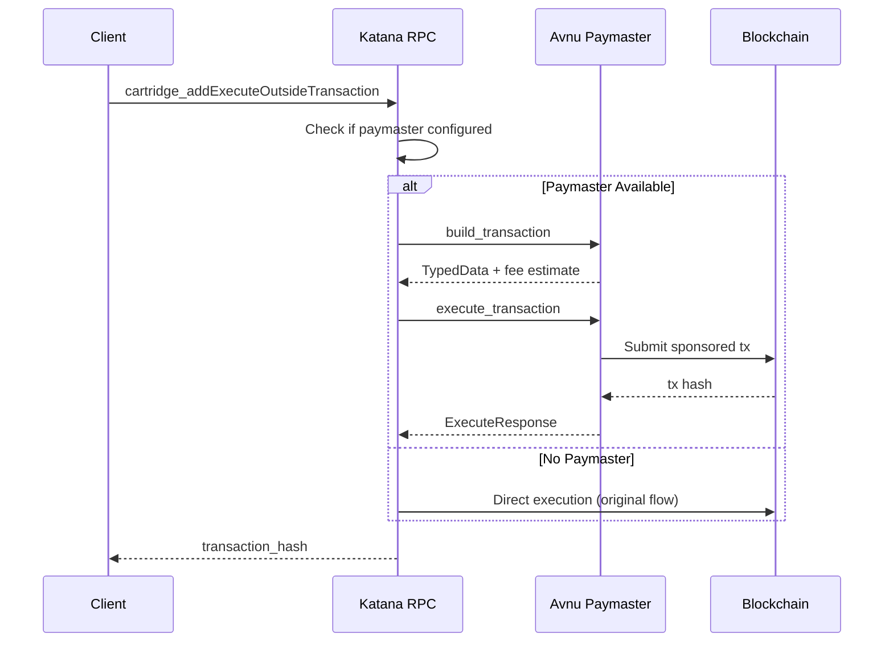
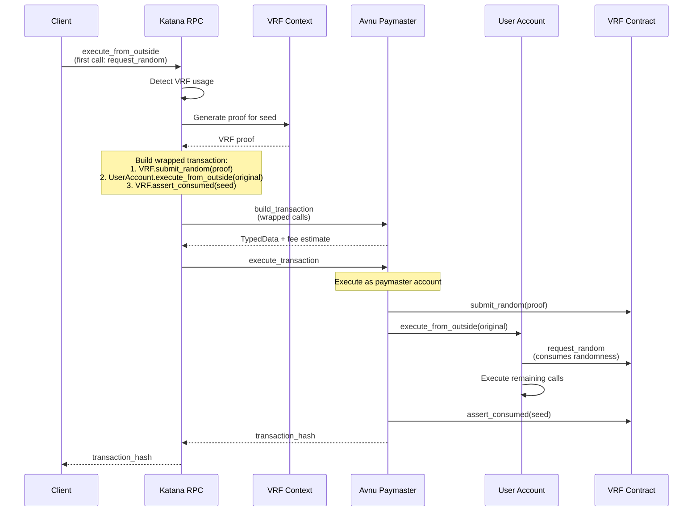

# Avnu Paymaster Integration Specification

## Overview
This specification documents the integration of the Avnu paymaster service into Katana's RPC interface, enabling sponsored transactions and maintaining support for Verifiable Random Function (VRF) capabilities through the existing Cartridge infrastructure.

## Architecture

### Components

#### 1. PaymasterService (`crates/rpc/rpc/src/paymaster/mod.rs`)
- **Purpose**: Provides the bridge between Katana and Avnu paymaster endpoints
- **Key Methods**:
  - `build_transaction()`: Constructs transactions with proper fee estimation
  - `execute_transaction()`: Submits transactions to Avnu for execution
- **Configuration**: Uses `PaymasterConfiguration` from `paymaster_rpc` crate
- **API Key Support**: Optional default API key for authentication

#### 2. CartridgeApi Enhancement (`crates/rpc/rpc/src/cartridge/mod.rs`)
- **Dual Mode Operation**:
  - **With Paymaster**: Routes through Avnu for sponsored execution
  - **Without Paymaster**: Falls back to original direct execution
- **VRF Integration**: Maintains support for on-chain randomness generation
- **Key Method**: `execute_outside_via_avnu_paymaster()`

#### 3. RPC API Extensions (`crates/rpc/rpc-api/src/paymaster.rs`)
- Exposes Avnu paymaster endpoints through Katana RPC
- Implements `PaymasterApi` trait with methods:
  - `health()`: Service health check
  - `is_available()`: Availability status
  - `build_transaction()`: Transaction construction
  - `execute_transaction()`: Transaction execution
  - `get_supported_tokens()`: Supported gas tokens

## Transaction Flow

### Standard Execute From Outside Flow


### VRF-Enabled Transaction Flow

When a client sends an `execute_from_outside` transaction with VRF `request_random` as the first call, Katana detects this and wraps the entire transaction with VRF setup and teardown calls:



**Key Points:**
- The user's `execute_from_outside` transaction is preserved intact
- The paymaster account wraps it with VRF calls
- This ensures the randomness is available when the user's contract needs it
- The entire flow is atomic - if any step fails, the whole transaction reverts

## Key Features

### 1. Sponsored Transactions
- Transactions can be sponsored through Avnu paymaster
- Configurable fee modes and gas tokens
- Support for time-bounded execution

### 2. VRF Support
- Maintains existing Cartridge VRF functionality
- Generates on-chain verifiable randomness
- Two sources of randomness:
  - **Nonce-based**: Uses contract address nonce
  - **Salt-based**: Uses provided salt value
- VRF calls are automatically detected and wrapped

### 3. Backward Compatibility
- System gracefully falls back to original execution when:
  - Paymaster is not configured
  - Paymaster service is unavailable
  - Transaction doesn't meet paymaster requirements

### 4. Controller Account Management
- Automatic deployment of controller accounts when needed
- Deterministic address generation using username as salt
- Version management for controller upgrades

## Configuration

### Node Configuration
```toml
[paymaster]
cartridge_api_url = "https://api.cartridge.gg"
default_api_key = "optional-api-key"

[paymaster.paymaster]
forwarder = "0x..." # Avnu forwarder address
gas_tank.address = "0x..." # Gas tank address
# Additional Avnu configuration
```

### Enabling Paymaster
```rust
// In node initialization (crates/node/src/lib.rs)
let paymaster = if let Some(paymaster_config) = &config.paymaster {
    let service = Arc::new(PaymasterService::new(
        paymaster_config.paymaster.clone(),
        paymaster_config.default_api_key.clone()
    ));

    let api = CartridgeApi::new(
        backend,
        block_producer,
        pool,
        task_spawner,
        paymaster_config.cartridge_api_url.clone(),
        Some(Arc::clone(&service)), // Enable Avnu paymaster
    );

    // Register RPC endpoints
    rpc_modules.merge(CartridgeApiServer::into_rpc(api))?;
    rpc_modules.merge(PaymasterApiServer::into_rpc(PaymasterRpc::new(service)))?;

    Some(paymaster_config)
} else {
    None
};
```

## Transaction Parameters

### ExecutionParameters
```rust
ExecutionParameters::V1 {
    fee_mode: FeeMode::Default {
        gas_token: Felt, // ETH address by default
        tip: TipPriority::Normal,
    },
    time_bounds: Some(TimeBounds {
        execute_after: u64,
        execute_before: u64,
    }),
}
```

### Supported Fee Modes
- `Default`: User pays with specified gas token
- `Sponsored`: Transaction fully sponsored by paymaster

## Error Handling

### Fallback Scenarios
1. **Paymaster Unavailable**: Falls back to direct execution
2. **Invalid Configuration**: Returns configuration error
3. **Build Failure**: Returns detailed error from Avnu
4. **Execution Failure**: Returns transaction execution error

### Error Types
- `StarknetApiError::unexpected()`: For Avnu communication failures
- Configuration errors for missing/invalid settings
- Transaction validation errors

## Testing

### Test Coverage
- `execute_outside_with_avnu_paymaster`: Tests Avnu paymaster flow
- `execute_outside_with_vrf`: Tests VRF integration with paymaster
- `build_and_execute_transaction_flow`: Tests two-step transaction flow
- `execute_outside_without_paymaster`: Tests fallback behavior

### Test Setup
```rust
let cartridge_api = CartridgeApi::new(
    backend,
    block_producer,
    pool,
    task_spawner,
    api_url,
    Some(paymaster_service), // Or None for fallback testing
);
```

## Security Considerations

1. **API Key Management**: Optional API key for paymaster authentication
2. **Signature Validation**: All execute_from_outside calls require valid signatures
3. **Time Bounds**: Transactions can be time-bounded for security
4. **VRF Security**: Private key for VRF must be kept secure

## Migration Guide

### From Direct Execution to Avnu Paymaster
1. Add paymaster configuration to node config
2. Ensure Avnu paymaster contract is deployed
3. Configure forwarder and gas tank addresses
4. No client-side changes required - existing `cartridge_addExecuteOutsideTransaction` calls work automatically

### Removing Old Implementation
The following components were removed/replaced:
- `build_execute_call_via_paymaster()` - Replaced by Avnu integration
- `map_chain_id()` - No longer needed
- Direct paymaster execution logic - Replaced by Avnu endpoints

## Future Enhancements

1. **Multi-token Support**: Extend beyond ETH for gas payments
2. **Dynamic Fee Adjustment**: Implement priority-based fee tiers
3. **VRF Caching**: Persistent storage for VRF nonces
4. **Batch Transactions**: Support for batched execute_from_outside calls
5. **Analytics**: Transaction metrics and sponsorship reporting