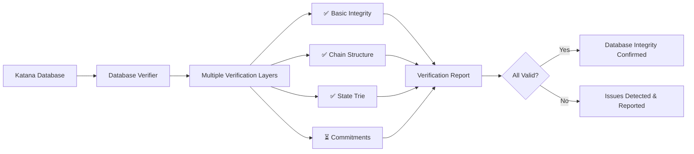
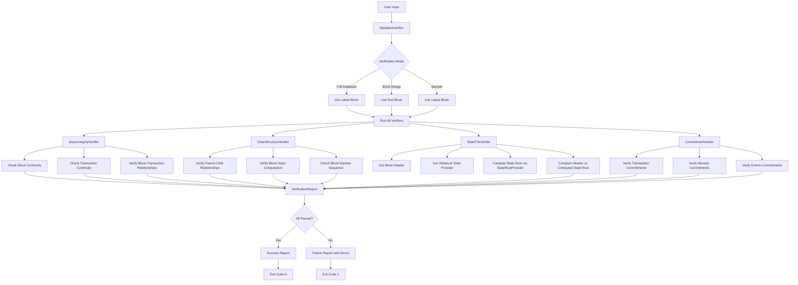

# Katana Database Verifier

A standalone tool for verifying the integrity of Katana blockchain databases. This crate provides comprehensive verification of blockchain data including block structure, transaction consistency, state trie correctness, and Merkle commitments.

## Overview



## Features

- **Basic Integrity Verification**: Checks database consistency, block-transaction relationships, and data structure integrity
- **Chain Structure Verification**: Verifies parent-child block relationships, block hash computation, and sequence integrity  
- **State Trie Verification**: Validates state root computation using StateRootProvider
- **Commitment Verification**: Verifies Merkle commitments for transactions, receipts, and events (planned)
- **Flexible Verification**: Full database, block range, or sampling verification modes
- **JSON Reports**: Detailed verification reports in JSON format

## Usage

### As a Library

```rust
use katana_verifier::DatabaseVerifier;
use katana_provider::providers::db::DbProvider;

// Create a database provider
let database = DbProvider::new(db_env);

// Create verifier with default verifiers
let verifier = DatabaseVerifier::new();

// Verify entire database
let report = verifier.verify_database(&database)?;

// Check results
if report.is_success() {
    println!("Database verification passed!");
} else {
    println!("Verification failed: {}", report);
}
```

### As a Command-Line Tool

```bash
# Verify entire database
katana-verifier --database /path/to/db

# Verify specific block range
katana-verifier --database /path/to/db --range 100:200

# Sample verification (every 10th block)
katana-verifier --database /path/to/db --sample 10

# Save report to JSON file
katana-verifier --database /path/to/db --output report.json

# Enable verbose logging
katana-verifier --database /path/to/db --verbose
```

## Verification Levels

### 1. Basic Integrity Verification
- Checks that all blocks exist in sequence without gaps
- Verifies block-transaction relationships
- Ensures data structure consistency

### 2. Chain Structure Verification  
- Validates parent-child block relationships
- Verifies block hash computation using `Header::compute_hash()`
- Checks block number sequence integrity

### 3. State Trie Verification
- Compares computed state roots with header state roots
- Uses StateRootProvider to efficiently compute state roots
- Verifies only the last block in the range for efficiency

### 4. Commitment Verification (Planned)
- Verifies transaction Merkle commitments
- Validates receipt commitments
- Checks events commitments

## Architecture

The verifier is built with a modular architecture:

- **`DatabaseVerifier`**: Main orchestrator that runs all verification checks
- **`Verifier` trait**: Interface for individual verification modules
- **`VerificationReport`**: Structured reporting of verification results
- **Individual verifiers**: Focused verification modules for specific aspects

### Verification Process Flow



### State Trie Verification Detail

```mermaid
graph TD
    A[StateTrieVerifier] --> B[Get Block Header]
    B --> C[Get Historical State Provider]
    C --> D[StateRootProvider.state_root()]
    
    D --> E[Get Contracts Trie Root]
    D --> F[Get Classes Trie Root]
    
    E --> G[Poseidon Hash Computation]
    F --> G
    G --> H["Poseidon(['STARKNET_STATE_V0', contracts_root, classes_root])"]
    
    H --> I[Computed State Root]
    B --> J[Header State Root]
    
    I --> K{Compare Roots}
    J --> K
    
    K -->|Match| L[✅ Verification Passed]
    K -->|Mismatch| M[❌ StateRootMismatch Error]
    
    L --> N[Continue to Next Verifier]
    M --> O[Report Failure]
```

### Database Interaction Pattern

```mermaid
graph LR
    A[Verifier] --> B[DbProvider]
    
    B --> C[HeaderProvider]
    B --> D[BlockHashProvider]
    B --> E[TransactionProvider]
    B --> F[StateFactoryProvider]
    
    C --> C1[header_by_number()]
    D --> D1[block_hash_by_num()]
    E --> E1[transactions_by_block()]
    F --> F1[historical()]
    
    F1 --> G[StateProvider]
    G --> H[StateRootProvider]
    H --> H1[state_root()]
    H --> H2[contracts_root()]
    H --> H3[classes_root()]
```

## Custom Verifiers

You can create custom verifiers by implementing the `Verifier` trait:

```rust
use katana_verifier::verifiers::Verifier;

#[derive(Debug)]
struct CustomVerifier;

impl Verifier for CustomVerifier {
    fn name(&self) -> &'static str {
        "CustomVerifier"
    }

    fn verify(&self, database: &DbProvider) -> Result<()> {
        // Your verification logic here
        Ok(())
    }
}

// Add to verifier
let mut verifier = DatabaseVerifier::new();
verifier.add_verifier(Box::new(CustomVerifier));
```

## Performance Considerations

- **Full verification**: Most thorough but can be slow for large databases
- **Range verification**: Faster when you only need to check specific blocks
- **Sampling verification**: Much faster for large databases, provides statistical confidence

## Implementation Status

- ✅ Basic integrity verification
- ✅ Chain structure verification  
- ✅ State trie verification
- ⏳ Commitment verification (planned)
- ⏳ Execution consistency verification (planned)

## Dependencies

This crate depends on:
- `katana-primitives`: Core blockchain data structures
- `katana-provider`: Database abstraction traits
- `katana-trie`: Merkle trie implementations (for future use)

## Testing

Run tests with:

```bash
cargo test -p katana-verifier
```

## Future Enhancements

- Complete state trie verification implementation
- Add commitment verification with Merkle tree computation
- Implement execution consistency verification
- Add parallel verification for better performance
- Support for different database backends
