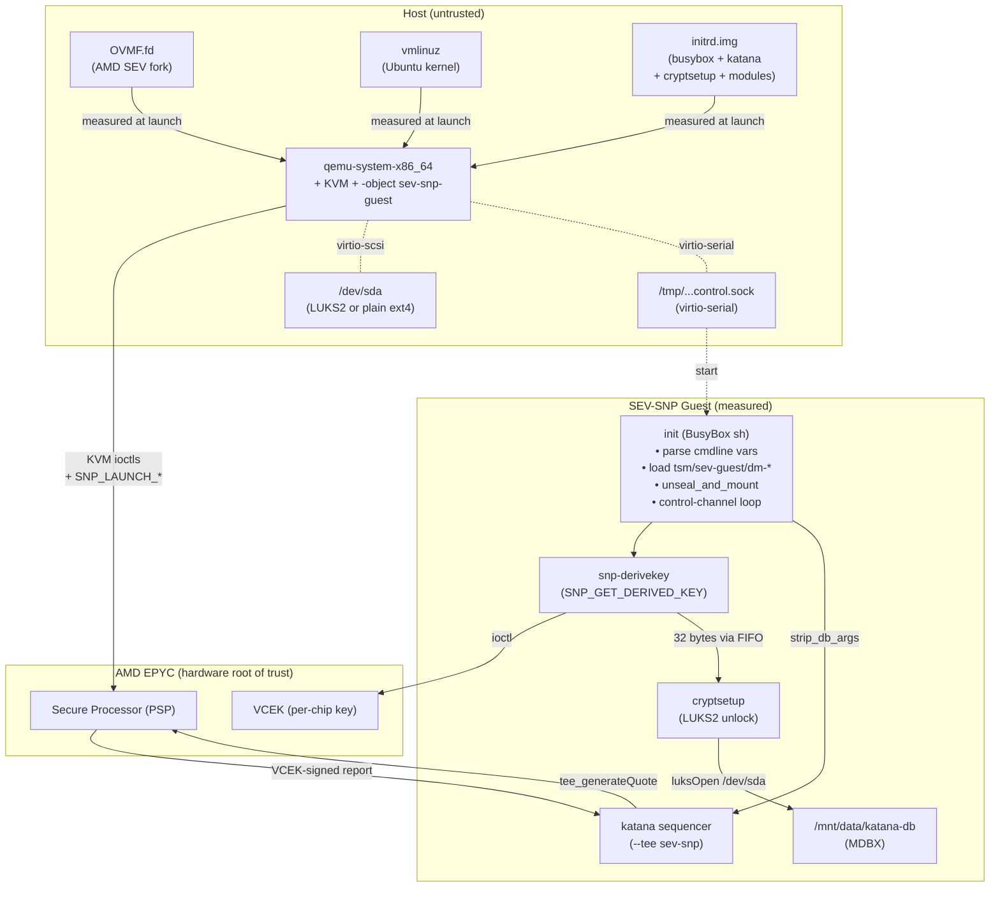
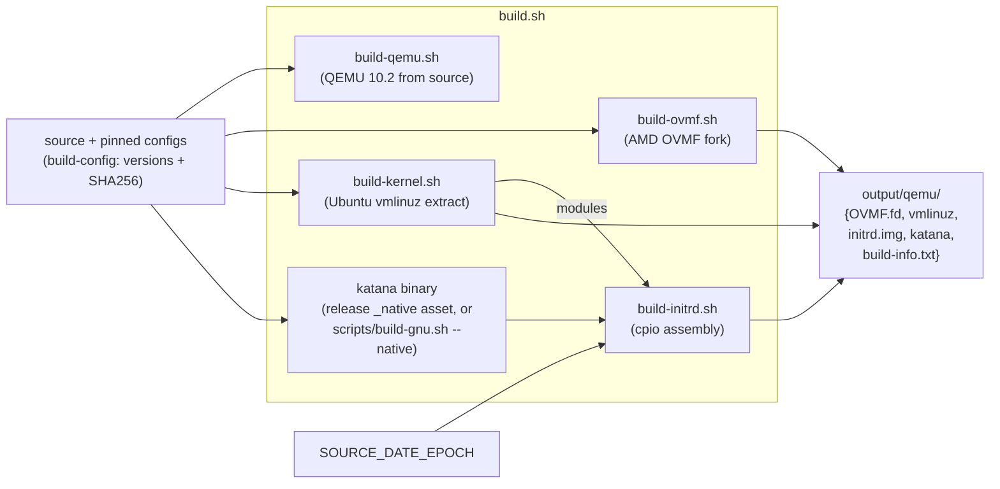
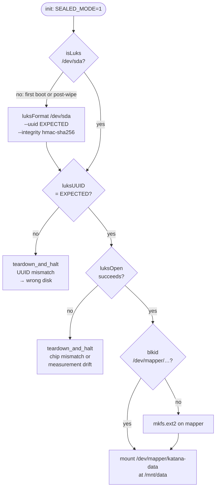

# AMD SEV-SNP TEE VM

Katana can run inside an AMD SEV-SNP confidential virtual machine. The VM's hardware-backed launch measurement binds the Katana binary (and everything else loaded at boot) to a signature the chip produces, which verifiers can check against the AMD Key Distribution Service (KDS). On top of that launch measurement, the `tee_generateQuote` RPC method emits attestation reports whose `report_data` field commits to Katana's current state roots — so a verifier can answer both "is this really the expected Katana binary running on a real AMD chip?" and "which state has it produced?"

Key properties:

- **Confidential compute** -- guest memory is encrypted with a per-VM key the host cannot read, even with root access to the hypervisor.
- **Hardware-backed launch measurement** -- OVMF + kernel + initrd + kernel cmdline are hashed into `AttestationReport.measurement`, signed by the chip's VCEK, verifiable against AMD KDS.
- **State-binding attestation** -- `tee_generateQuote` produces a report whose `report_data` is a Poseidon commitment over prev/current state root and block hash plus, depending on mode, either a messages commitment (appchain) or a fork-block-number + events commitment (sharding). The exact field list is in [`crates/rpc/rpc-server/src/tee.rs`](../crates/rpc/rpc-server/src/tee.rs); verifiers must reconstruct it byte-for-byte, so treat that file as the canonical schema.
- **Reproducibility** -- every *external* input (apt package versions, SHA256, cryptsetup source tarball, builder container image digest) is pinnable via environment variables listed in `misc/AMDSEV/build-initrd.sh`. `SOURCE_DATE_EPOCH` **must be set explicitly** for deterministic output — `build.sh` defaults it to the current timestamp, which is not reproducible. Two builds from the same pinned inputs produce byte-identical OVMF/kernel/initrd and therefore the same measurement.
- **Persistent storage (unsealed by default, sealed opt-in)** -- the MDBX database lives on `/dev/sda`. By default it is plain ext4. `start-vm.sh --sealed` instead wraps it in a LUKS2 + dm-integrity volume whose keyslot is unlocked by a 32-byte key derived inside the guest via `SNP_GET_DERIVED_KEY`; the disk's actual encryption master key is generated by cryptsetup at format time and stored (wrapped by the derived key) in the LUKS header, so the disk only opens on the exact chip with the exact measured image. Sealed and unsealed boots produce different, separately pinnable measurements. Sealed storage is **not** the default because its measurement-bound key is not forward-compatible across Katana versions and does not hold against an untrusted host — see [Sealed storage](#sealed-storage).

For how to actually build and run the VM, see [`misc/AMDSEV/README.md`](../misc/AMDSEV/README.md). This document describes the *architecture* — how the pieces fit together and what each one is responsible for.

## Architecture



Three layers of trust, outside-in:

1. **Host (untrusted).** Runs QEMU with KVM, attaches the virtual disk, and drives the control channel. The host operator can observe and modify *everything outside the measured boot components and encrypted guest memory.* In particular, the host can swap the contents of `/dev/sda` between VM restarts — which is the whole reason sealed storage exists.
2. **Measured guest (trusted for what's measured).** Everything that gets hashed into the launch measurement: OVMF, kernel, initrd, and the kernel command line. A verifier who reproduces this measurement and matches it against the attestation report knows the guest booted *exactly this code*.
3. **Chip (hardware root of trust).** The AMD Secure Processor derives per-VM memory-encryption keys and per-chip attestation signing keys (VCEK). The launch measurement lives inside the signed attestation report; the VCEK chains up to an AMD root key that's published via KDS.

## Components

| Component | Location | Role |
|-----------|----------|------|
| **OVMF firmware** (`OVMF.fd`) | `misc/AMDSEV/build-ovmf.sh` → `output/qemu/OVMF.fd` | UEFI firmware. Built from [AMD's OVMF fork](https://github.com/AMDESE/ovmf) (`AmdSevX64.dsc`) which reserves the 1 KB hash-table region SEV-SNP uses to inject kernel/initrd/cmdline digests into the measurement. |
| **Linux kernel** (`vmlinuz`) | `misc/AMDSEV/build-kernel.sh` → `output/qemu/vmlinuz` | Ubuntu-supplied kernel; SEV-SNP guest-side drivers (`tsm`, `sev-guest`) plus `dm-mod`, `dm-crypt`, `dm-integrity` are loaded from modules shipped inside the initrd. |
| **initrd** (`initrd.img`) | `misc/AMDSEV/build-initrd.sh` → `output/qemu/initrd.img` | Self-contained root filesystem. Measured at launch. Contains the `init` script and every userspace binary the guest ever runs. See [initrd layout](#initrd-layout) below. |
| **katana binary** | The `katana_<ver>_linux_amd64_native.tar.gz` release asset (built by `release.yml` with `--features native`, LLVM/MLIR 19 statically linked); `scripts/build-gnu.sh --native` builds the same configuration from source | Sequencer itself, cairo-native-enabled (in-guest native execution behind `--enable-native-compilation`, off by default). Dynamically linked against glibc; the initrd vendors a pinned glibc runtime (`libc.so.6` and its dependencies) under `lib64/` and `usr/lib/x86_64-linux-gnu/`. Runtime package versions are pinned in `misc/AMDSEV/build-config` (`GLIBC_RUNTIME_PACKAGES` / `GLIBC_RUNTIME_PACKAGE_SHA256S`) and recorded in `build-info.txt` as `GLIBC_VERSION`. Note: unlike the previously embedded portable build, the native asset is not yet reproducible-from-source — image verification pins it by `KATANA_BINARY_SHA256`. |
| **`snp-derivekey`** (new) | `crates/tee/src/bin/derivekey.rs` (built with `--features snp`) | Tiny helper the init script runs once at boot to derive the LUKS unseal key from `SNP_GET_DERIVED_KEY`. See [Sealed storage](#sealed-storage). |
| **`cryptsetup`** (new) | Built from pinned source inside a pinned Alpine container (SECTION 3 of `build-initrd.sh`) | Drives LUKS2 open/format and dm-integrity setup. Static-musl, single binary, no runtime library dependencies. |
| **`start-vm.sh`** | `misc/AMDSEV/start-vm.sh` | Host-side launcher. Wires OVMF + kernel + initrd + disk + virtio-serial control channel together and invokes QEMU with the correct `-object sev-snp-guest,…,kernel-hashes=on` flags. |
| **`snp-tools/snp-digest`** | `misc/AMDSEV/snp-tools/` | Reproduces the expected launch measurement from the same inputs QEMU hashes. Verifiers use this. |
| **`snp-tools/snp-report`** | `misc/AMDSEV/snp-tools/` | Decodes a raw attestation report into human-readable form. |

### initrd layout

The initrd is a gzipped cpio archive with a single-user layout. The helper binaries (busybox, cryptsetup, snp-derivekey, ld) are statically linked; katana is glibc-dynamic, and the initrd vendors a pinned glibc runtime alongside it.

```
/
├── bin/
│   ├── busybox            (static, provides /bin/sh and ~20 applets via symlinks)
│   ├── sh → busybox
│   ├── mount → busybox    (and tr, grep, mkfifo, mkfs.ext2, etc.)
│   ├── katana             (glibc-dynamic; needs the runtime under lib64/ + usr/lib/)
│   ├── snp-derivekey      (static; calls SNP_GET_DERIVED_KEY)
│   ├── cryptsetup         (static; LUKS2 + dm-integrity driver)
│   └── ld                 (static GNU ld; cairo-native links AOT-compiled classes
│                           with it at runtime under --enable-native-compilation)
├── lib/modules/
│   ├── tsm.ko             (TSM configfs interface for attestation reports)
│   ├── sev-guest.ko       (/dev/sev-guest device for SNP ioctls)
│   ├── dm-mod.ko          (device-mapper core)
│   ├── dm-crypt.ko        (block-level encryption)
│   └── dm-integrity.ko    (sector-level authentication)
├── lib64/
│   ├── ld-linux-x86-64.so.2   (ELF interpreter; path is the one /bin/katana embeds)
│   └── libc.so            (generated linker script — resolves ld's `-lc` to the
│                           vendored libc.so.6 + libc_nonshared.a)
├── usr/lib/x86_64-linux-gnu/
│   ├── libc.so.6, libgcc_s.so.1, libm.so.6, libstdc++.so.6, libz.so.1, liblzma.so.5
│   ├── libc_nonshared.a   (from the pinned libc6-dev deb; -lc link input)
│   └── libnss_dns.so.2, libnss_files.so.2, libresolv.so.2  (optional NSS plugins)
├── init                   (BusyBox shell script; PID 1)
├── dev/, proc/, sys/, tmp/, etc/, mnt/
```

Everything under `bin/`, `lib/modules/`, `lib64/`, and `usr/lib/` is hashed into the launch measurement (as part of the cpio archive), so any tampering — including swapping the bundled glibc — produces a different measurement and verifiers reject the quote.

## Build pipeline

Driven by `misc/AMDSEV/build.sh`, which orchestrates four sub-scripts. The build is *reproducible*: identical inputs produce identical OVMF/kernel/initrd bytes, and therefore the same `AttestationReport.measurement`.



The `build-initrd.sh` step is the most dependency-heavy:

1. Download pinned `.deb` packages via `apt-get download`: `busybox-static`, `linux-modules`, `linux-modules-extra`, plus the glibc runtime packages (`libc6`, `libgcc-s1`, `libstdc++6`, `zlib1g`, `liblzma5`) when the supplied katana binary is dynamically linked, and `libc6-dev` (for `libc_nonshared.a`) when a `ld` binary is bundled. Verify SHA256.
2. Extract them into a staging directory with `dpkg-deb -x`.
3. **Build a statically-linked `cryptsetup`** inside a pinned Alpine container (`CRYPTSETUP_BUILDER_IMAGE=alpine@sha256:…`). Alpine's musl + `*-static` packages (openssl, popt, argon2, …) produce a single binary with no runtime library dependencies, verified via `ldd`. **A statically-linked GNU `ld`** is built from pinned binutils source inside the same container (`scripts/build-binutils-ld.sh`) — cairo-native shells out to it at runtime.
4. Assemble the initrd directory: install busybox + symlinks, install `cryptsetup`, cherry-pick `tsm.ko` / `sev-guest.ko` / `dm-mod.ko` / `dm-crypt.ko` / `dm-integrity.ko`, copy the Katana binary, copy `snp-derivekey`, install `bin/ld` plus its `-lc` link inputs (`libc_nonshared.a` and a generated `/lib64/libc.so` linker script pointing at the initrd's actual libc paths), install the ELF interpreter (`lib64/ld-linux-x86-64.so.2`) and every `NEEDED` shared library walked transitively from `bin/katana` (plus a small set of optional NSS plugins), emit the `init` script.
5. Normalize timestamps to `SOURCE_DATE_EPOCH`, create a sorted reproducible cpio archive, gzip with `-n`.
6. Record the actual glibc version (queried by running the installed `libc.so.6`) into a `glibc-version.txt` sidecar; `build.sh` promotes it into `build-info.txt` as `GLIBC_VERSION`.

## Launch measurement

When QEMU starts the guest with `-object sev-snp-guest,…,kernel-hashes=on`, the AMD Secure Processor (PSP) computes `LAUNCH_MEASURE` over the guest's initial memory. With `kernel-hashes=on`, QEMU additionally injects SHA-256 digests of the kernel, initrd, and kernel command line into a reserved 1 KB region in OVMF, so the measurement covers *all four inputs*.

**What IS in the measurement:**

| Input | Where it's measured |
|-------|---------------------|
| `OVMF.fd` | Loaded into guest memory page-by-page; each page is hashed. |
| `vmlinuz` | SHA-256 injected into OVMF's reserved hash region by QEMU. |
| `initrd.img` | Same as kernel. |
| Kernel cmdline string | Same as kernel. Every byte matters — including the sealed-storage token `KATANA_EXPECTED_LUKS_UUID=<uuid>` if present. Sealed and unsealed boots therefore produce different measurements; verifiers pin whichever one they expect. |

**What is NOT in the measurement** (this is load-bearing):

- The MDBX database on `/dev/sda`. This is exactly why [sealed storage](#sealed-storage) exists.
- Any data fetched over the network at runtime.
- Arguments sent to Katana over the virtio-serial control channel (they arrive *after* launch).
- The data disk's filesystem contents in general.

A verifier reproduces the expected measurement with `snp-digest`:

```sh
snp-digest --ovmf output/qemu/OVMF.fd \
           --kernel output/qemu/vmlinuz \
           --initrd output/qemu/initrd.img \
           --append "console=ttyS0 KATANA_EXPECTED_LUKS_UUID=<uuid>" \
           --vcpus 1 --cpu epyc-v4 --vmm qemu --guest-features 0x1
```

The output digest must equal the `measurement` field of the attestation report. Because the cmdline is measured, unsealed and sealed boots produce *distinct* measurements. Verifiers pin whichever one they expect — the unsealed variant for the default boot, or the sealed variant when the VM is launched with `--sealed`.

## Guest runtime

```mermaid
flowchart TD
    Start([PID 1: /init])
    Mount[Mount /proc /sys /dev /tmp<br/>Create /dev/null /dev/console etc.<br/>Redirect fds to /dev/console]
    LoadSev["insmod tsm.ko sev-guest.ko<br/>Create /dev/sev-guest if needed"]
    Parse["parse_cmdline_vars<br/>(read /proc/cmdline)"]
    LoadDM["load_dm_modules<br/>(dm-mod → dm-crypt → dm-integrity)"]
    Network[Configure eth0<br/>(QEMU user-mode defaults)]
    Decide{SEALED_MODE<br/>= 1?}
    UnsealFlow["unseal_and_mount<br/>• /dev/sev-guest present?<br/>• snp-derivekey → FIFO → cryptsetup<br/>• no header: luksFormat (first boot)<br/>• verify disk UUID = expected<br/>• luksOpen → mkfs.ext2 if empty<br/>• mount /dev/mapper/katana-data"]
    PlainMount["mount -t ext4 /dev/sda /mnt/data<br/>(legacy / dev-only path)"]
    WaitCtl[Wait for org.katana.control.0<br/>virtio-serial port]
    Loop[Read control commands]
    StartCmd["start <csv>"]
    StripArgs["strip_db_args<br/>(drops --db-dir / --db-*)"]
    Katana["/bin/katana --db-dir=/mnt/data/katana-db …"]
    FatalBoot{fatal_boot<br/>on any failure}
    Teardown["teardown_and_halt<br/>• SIGTERM katana (30s grace → KILL)<br/>• umount /mnt/data<br/>• cryptsetup luksClose<br/>• umount /proc /sys etc.<br/>• poweroff -f"]

    Start --> Mount --> LoadSev --> Parse --> LoadDM --> Network --> Decide
    Decide -->|yes| UnsealFlow
    Decide -->|no| PlainMount
    UnsealFlow --> WaitCtl
    PlainMount --> WaitCtl
    WaitCtl --> Loop
    Loop --> StartCmd --> StripArgs --> Katana
    Loop -.->|SIGTERM / SIGINT| Teardown
    FatalBoot -.->|any error| Teardown
```

Key invariants the init script enforces:

- **Failure is always terminal.** Any error — missing `/dev/sev-guest`, UUID mismatch, `luksOpen` failure, mount failure — goes through `teardown_and_halt` and powers off. There is no "continue on best effort" path; a half-unlocked or wrong-UUID disk must never be mountable.
- **Teardown is idempotent.** `fatal_boot` may fire *before* the LUKS device is opened or the mount exists. Every `umount` / `luksClose` tolerates missing state. The `SHUTTING_DOWN` re-entry guard prevents recursion when an error happens inside `teardown_and_halt` itself.
- **The control channel is untrusted.** Arguments arriving over virtio-serial (from the host operator) are *not* measured. `strip_db_args` drops any `--db-dir` / `--db-*` before invoking Katana so the operator cannot redirect Katana out of the sealed mount. The measured initrd owns the `--db-dir` value, not the control channel.
- **Logs go to stderr.** Both stdout and stderr are redirected to `/dev/console`, but `log()` writes only to stderr so `$(strip_db_args …)` captures only the function's real output. Important because several helpers now rely on command substitution.

## Sealed storage

**Sealed storage is opt-in.** `start-vm.sh` boots **unsealed** (plain ext4 on `/dev/sda`) by default; pass `--sealed` to enable the LUKS2 + dm-integrity path described here. The rationale for the default — and the options for lifting the limitation that drives it — is in [Forward-compatibility and the key-binding limitation](#forward-compatibility-and-the-key-binding-limitation) at the end of this section.

When `KATANA_EXPECTED_LUKS_UUID=<uuid>` is set in the measured kernel cmdline (which `--sealed` does), the init script treats `/dev/sda` as a LUKS2 + dm-integrity volume. The LUKS *master key* (the actual AES key used to encrypt sectors) is generated by cryptsetup at format time and stored, wrapped, in the LUKS header. What the guest supplies via `snp-derivekey` is the **keyslot unlock secret** — 32 bytes that unwrap the master key out of the header. The unlock secret is chosen so that:

- **Different chip** (different VCEK) → different derived secret → keyslot unwrap fails → `luksOpen` fails.
- **Different measured image** (kernel / initrd / OVMF / cmdline differs) → different derived secret → `luksOpen` fails.
- **Tampered ciphertext** (operator modifies sectors out-of-band) → dm-integrity authentication fails at the block layer.

### Key derivation

`snp-derivekey` (`crates/tee/src/bin/derivekey.rs`) issues `SNP_GET_DERIVED_KEY` with:

| Field | Value | Why |
|-------|-------|-----|
| `root_key_select` | `0` (VCEK) | Per-chip identity. The only choice upstream Linux's `/dev/sev-guest` UAPI exposes today. |
| `guest_field_select` | `MEASUREMENT \| GUEST_POLICY` (binary `001001` = 9) | Binds the key to the measured image and guest policy. |
| `guest_svn` | `0` | **Deliberately off.** Mixing SVN would rotate the key on every SVN bump. |
| `tcb_version` | `0` | **Deliberately off.** Same reason: firmware updates would brick the sealed disk. |
| `vmpl` | `1` | Domain separator for the sealed-storage use case. *Not* a privilege boundary — a VMPL0 caller can request a VMPL1 key. |

The binary wraps the 32-byte result in `zeroize::Zeroizing` so the bytes are zeroed from its own stack before exit. A panic hook aborts the process (`SIGABRT`) rather than unwinding, so the key cannot survive in memory through arbitrary destructors.

### LUKS2 + dm-integrity

The init script pipes the 32 bytes from `snp-derivekey` into `cryptsetup` via a 0600-mode FIFO (`/tmp/katana-luks.key`). The FIFO is created fresh per invocation, and the writer exits as soon as `cryptsetup` consumes the key.

LUKS header parameters (set at first-boot format; only UUID is verified on subsequent opens — see the note below):

| Parameter | Value | Rationale |
|-----------|-------|-----------|
| `--type` | `luks2` | LUKS1 doesn't support integrity. |
| `--cipher` | `aes-xts-plain64` | Standard block-device cipher. XTS gives confidentiality only, which is why the integrity layer below is non-optional. |
| `--key-size` | `512` | 256-bit AES per half (XTS consumes 2× key length). |
| `--integrity` | `hmac-sha256` | Sector-level authentication via `dm-integrity`. Catches offline ciphertext tampering. |
| `--uuid` | `$KATANA_EXPECTED_LUKS_UUID` | Pinned in the measured cmdline. Normal boot rejects any other UUID. |
| `--pbkdf` | `pbkdf2` | We supply the raw 32-byte key; `argon2id`'s KDF strengthening is wasted compute. |
| `--pbkdf-force-iterations` | `1000` | Minimum allowed. Same reasoning. |

**What the init actually checks on open.** On a non-first-boot, the init runs `cryptsetup isLuks`, then `cryptsetup luksUUID` against `$KATANA_EXPECTED_LUKS_UUID`, then `cryptsetup luksOpen --key-file=<fifo>`. It does **not** verify that the cipher, key-size, integrity algorithm, or PBKDF match the parameters in the table above. The security argument rests on the derived-key check: an attacker who can mint a LUKS disk with the expected UUID but different parameters still cannot open it, because `luksOpen` with the wrong key fails. If you need parameter enforcement (e.g. to catch a downgrade to a non-integrity LUKS disk), add a `cryptsetup luksDump --dump-json-metadata` check before the open.

**Why this catches sector-rollback but not whole-disk-rollback.** `dm-integrity` tags each sector with an HMAC whose integrity metadata lives inline on the disk. An attacker who overwrites one sector without the HMAC tag will cause the next read to fail. An attacker who rolls back *everything* — data + tags + LUKS header — to an earlier snapshot, keeping the same UUID, gets a self-consistent disk that opens cleanly. UUID pinning does not prevent this; it only prevents swapping in a disk with a *different* UUID. Closing whole-disk rollback needs an external monotonic counter, tracked as a verifier-side concern. See [trust model](#trust-model).

### Boot flow



A single sealed-mode measurement. First boot and every subsequent boot run the same init script with the same cmdline — the only difference is whether `/dev/sda` already has a LUKS header. Absent header → format with the expected UUID and the current measurement's derived key, then open. Present header → enforce UUID, then open.

**What the header-absent path costs in threat-model terms.** An attacker who wipes the LUKS header forces the next boot to reformat under the same measurement. They end up with a functional sealed disk whose contents they never see, but whose chain history is reset to block 0. This is a DoS downgrade, not a state-substitution attack: the verifier sees a fresh genesis quote and — per the trust model — must reject any quote whose `block_number = 0` state does not match the independently-pinned chain anchor. Sealing never closed anchor-substitution; this change does not widen the gap.

### Forward-compatibility and the key-binding limitation

This is why sealed storage is **not** the default.

The derived key binds to `MEASUREMENT | GUEST_POLICY`, and the Katana binary is part of the measured initrd. So a Katana version bump changes the initrd hash → the measurement → the derived key, and a disk sealed by the old version **no longer opens** under the new one (`luksOpen` halts on "measurement drift"). The new binary can't even decrypt the disk — long before any database-format migration would run.

Two layers are actually in play, and only the sealing layer is a blocker:

- **Database format (`katana-db`):** already forward-migratable. A current binary opens on-disk versions in the range `[MIN_OPENABLE_DB_VERSION, LATEST_DB_VERSION]` (see `crates/storage/db/src/version.rs`), runs staged migrations on open, and auto-creates new tables. **In the default unsealed mode there is no sealing wall, so a newer Katana opens an older Katana's database normally** (subject only to that version window). The migration is one-way — once migrated, an older binary can no longer open it.
- **Sealing key (`--sealed` only):** the hard blocker above. It applies *only* when sealed storage is enabled.

Note the key is *already* decoupled from routine platform changes: `snp-derivekey` leaves the `TCB_VERSION` and `GUEST_SVN` field-select bits off (see [Key derivation](#key-derivation)), so firmware/microcode/SVN updates do **not** re-key the disk. Only the measurement — which carries the Katana binary — still rotates it.

#### Solutions considered to decouple the key from the Katana version

| Option | Idea | Survives upgrades | Holds vs untrusted host | Status |
|---|---|---|---|---|
| **A — stable identity fields** | Bind the key to `FAMILY_ID` / `IMAGE_ID` instead of `MEASUREMENT`. | ✅ | ❌ — those fields are supplied in the host-controlled ID block at launch and the firmware does not pin them to a signer, so an untrusted host can forge them and unseal with arbitrary code. Collapses to roughly plain disk encryption. | **Rejected** under this threat model |
| **B — attestation-gated KMS** | Guest attests; an external KMS releases the disk key only for an allow-listed measurement. New version → add its measurement to the allow-list. | ✅ | ✅ — preserves "only attested code decrypts" | **Viable, not built.** Adds a KMS + allow-list (with a revocation / min-version policy) + boot-time network dependency to the TCB, and a long-lived escrowed key to protect |
| **C — wrapped DEK + re-key ceremony** | Store a random disk key wrapped by the measurement-derived KEK; on upgrade, a transition step unwraps with the old KEK and re-wraps with the new. No disk re-encryption. | ✅ | ✅ (if the transition image is trusted) | **Considered, not pursued.** A running image can't derive the *next* measurement's key, so the ceremony needs a transition image trusted with both KEKs at once — most operational complexity |
| **D — unsealed (current default)** | No derived key; plain ext4. | ✅ (nothing to re-key) | n/a — no confidentiality/integrity at rest | **Current default** |

The decision is fundamentally *where to put the trust anchor.* Option A pushes it onto host-controlled launch values, which is untenable when the host is untrusted: it does not merely weaken the at-rest guarantee, it removes cryptographic access control against the primary adversary (and, sharing the integrity key, enables state substitution). Its only residual value over plain encryption is that the chip-bound VCEK still defeats *off-box* disk theft — equivalent to TPM-without-PCR-binding, not to measurement sealing. Option B keeps the guarantee but relocates the anchor to a data-owner-controlled KMS + allow-list, which is real work.

Rather than ship a sealed default that breaks on upgrade *and* overstates its protection against the very adversary SEV-SNP targets, the default is honest **unsealed** storage; `--sealed` remains fully supported (and exercised by `misc/AMDSEV/scripts/test-snp-e2e.sh`) for deployments that have weighed the trade-offs — e.g. a fixed Katana version, or a trusted single-tenant operator concerned only with off-box disk theft. **Until one of options A–C is adopted, treat a Katana upgrade under `--sealed` as a fresh disk, not an in-place migration** (the current policy is "resync from peers after upgrade"). Adopting Option B is the natural next step if persistent sealed state must survive upgrades; it is deferred.

## Attestation surface

Once the guest is fully up, Katana listens on the RPC endpoint (forwarded by `start-vm.sh` to `localhost:15051` by default). The `tee_generateQuote` method wraps the SEV-SNP attestation flow:

1. Compute a Poseidon commitment over `(prev_state_root, state_root, prev_block_hash, block_hash, …)`.
2. Copy the 32-byte digest into `report_data[0..32]` (the rest is zero).
3. Issue `SNP_GET_REPORT` via `/dev/sev-guest`.
4. Return the raw 1184-byte report plus metadata.

The exact commitment formula and all the caveats about what it does and doesn't prove live in [`crates/tee/src/lib.rs`](../crates/tee/src/lib.rs) and [`crates/rpc/rpc-api/src/tee.rs`](../crates/rpc/rpc-api/src/tee.rs). That documentation is load-bearing — read it before integrating a verifier.

## Trust model

A TEE quote binds exactly two things: the launch measurement, and the 64-byte `report_data` supplied by the caller. Everything else is outside the guarantee.

- ✅ **The quote proves:** the reported roots were computed by code matching `measurement`, running on a chip whose VCEK chains up to AMD's root key.
- ❌ **The quote does not prove:** that the roots belong to a canonical chain. The guest reads them out of local storage; if the sealed disk is bypassed somehow (e.g. unsealed-mode boot), any roots fit the signature. Sealed mode closes the "operator swaps DB between restarts" hole but not anchor substitution or whole-disk rollback.

Verifier obligations, at minimum:

1. **Reproduce the measurement** from OVMF + vmlinuz + initrd + cmdline and match it against the report. Reject anything else.
2. **Pin the genesis or fork anchor** out-of-band (chain-spec hash published separately, or an L1 contract) so a freshly-provisioned sealed VM can't fake a clean history from block 0.
3. **Walk an unbroken chain of quotes** from that anchor to the block of interest, checking that each quote's `prev_block_hash` matches the previous quote's `block_hash`. The chain forces a tamper to forge every quote, not just one.

Known residual gaps (tracked for follow-up):

- **Whole-disk rollback** within the same VM identity. Needs an external monotonic commitment (e.g. L1 event log).
- **Genesis / fork anchor pinning** is a verifier-side concern; there is no in-repo reference implementation yet.
- **Measurement upgrade story (sealed mode only).** Under `--sealed`, any kernel/initrd/katana upgrade rotates the derived key and renders the old sealed disk unreadable; the current policy is "resync from peers after upgrade." This is the main reason sealed storage is opt-in rather than the default — see [Forward-compatibility and the key-binding limitation](#forward-compatibility-and-the-key-binding-limitation) for the decoupling options (an attestation-gated KMS being the viable one). The default unsealed boot has no such limitation.

## Related documents

- [`misc/AMDSEV/README.md`](../misc/AMDSEV/README.md) — operational how-to (building, running, decoding reports, troubleshooting).
- [`crates/tee/src/lib.rs`](../crates/tee/src/lib.rs) — `katana-tee` crate docs. Canonical trust-model reference.
- [`crates/rpc/rpc-api/src/tee.rs`](../crates/rpc/rpc-api/src/tee.rs) — `tee_generateQuote` / `tee_getEventProof` RPC schema.
- [`misc/AMDSEV/snp-tools/`](../misc/AMDSEV/snp-tools/) — `snp-digest`, `snp-report`, `ovmf-metadata`.
- [QEMU SEV-SNP launch reference](https://www.qemu.org/docs/master/system/i386/amd-memory-encryption.html#launching-sev-snp)
- [AMD SEV-SNP ABI specification](https://www.amd.com/content/dam/amd/en/documents/developer/56860.pdf)
