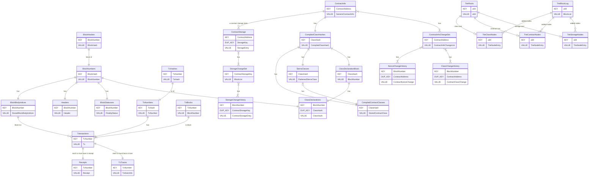

# Database

## Table layout

```mermaid
erDiagram

Headers {
    KEY BlockNumber
    VALUE Header
}

BlockHashes {
    KEY BlockNumber
    VALUE BlockHash
}

BlockNumbers {
    KEY BlockHash
    VALUE BlockNumber
}

BlockStatusses {
    KEY BlockNumber
    VALUE FinalityStatus
}

BlockBodyIndices {
    KEY BlockNumber
    VALUE StoredBlockBodyIndices
}

TxNumbers {
    KEY TxHash
    VALUE TxNumber
}

TxHashes {
    KEY TxNumber
    VALUE TxHash
}

TxTraces {
    KEY TxNumber
    VALUE TxExecInfo
}

Transactions {
    KEY TxNumber
    VALUE Tx
}

TxBlocks {
    KEY TxNumber
    VALUE BlockNumber
}

Receipts {
    KEY TxNumber
    VALUE Receipt
}

CompiledClassHashes {
    KEY ClassHash
    VALUE CompiledClassHash
}

CompiledContractClasses {
    KEY ClassHash
    VALUE StoredContractClass
}

SierraClasses {
    KEY ClassHash
    VALUE FlattenedSierraClass
}

ContractInfo {
    KEY ContractAddress
    VALUE GenericContractInfo
}

ContractStorage {
    KEY ContractAddress
    DUP_KEY StorageKey
    VALUE StorageEntry
}

ClassDeclarationBlock {
    KEY ClassHash
    VALUE BlockNumber
}

ClassDeclarations {
    KEY BlockNumber
    DUP_KEY ClassHash
    VALUE ClassHash
}

ContractInfoChangeSet {
    KEY ContractAddress
    VALUE ContractInfoChangeList
}

NonceChangeHistory {
    KEY BlockNumber
    DUP_KEY ContractAddress
    VALUE ContractNonceChange
}

ClassChangeHistory {
    KEY BlockNumber
    DUP_KEY ContractAddress
    VALUE ContractClassChange
}

StorageChangeSet {
    KEY ContractStorageKey
    VALUE BlockList
}

StorageChangeHistory {
    KEY BlockNumber
    DUP_KEY ContractStorageKey
    VALUE ContractStorageEntry
}

TrieClassNodes {
    KEY u64
    VALUE TrieNodeEntry
}

TrieContractNodes {
    KEY u64
    VALUE TrieNodeEntry
}

TrieStorageNodes {
    KEY u64
    VALUE TrieNodeEntry
}

TrieRoots {
    KEY u64
    VALUE u64
}

TrieBlockLog {
    KEY u64
    VALUE BlockList
}


BlockHashes ||--|| BlockNumbers : "block id"
BlockNumbers ||--|| BlockBodyIndices : "has"
BlockNumbers ||--|| Headers : "has"
BlockNumbers ||--|| BlockStatusses : "has"

BlockBodyIndices ||--o{ Transactions : "block txs"

TxHashes ||--|| TxNumbers : "tx id"
TxNumbers ||--|| Transactions : "has"
TxBlocks ||--|{ Transactions : "tx block"
Transactions ||--|| Receipts : "each tx must have a receipt"
Transactions ||--|| TxTraces : "each tx must have a trace"

CompiledClassHashes ||--|| CompiledContractClasses : "has"
CompiledClassHashes ||--|| SierraClasses : "has"
SierraClasses |o--|| CompiledContractClasses : "has"

ContractInfo ||--o{ ContractStorage : "a contract storage slots"
ContractInfo ||--|| CompiledClassHashes : "has"

ContractInfo }|--|{ ContractInfoChangeSet : "has"
ContractStorage }|--|{ StorageChangeSet : "has"
ContractInfoChangeSet }|--|{ NonceChangeHistory : "has"
ContractInfoChangeSet }|--|{ ClassChangeHistory : "has"
CompiledClassHashes ||--|| ClassDeclarationBlock : "has"
ClassDeclarationBlock ||--|| ClassDeclarations : "has"
BlockNumbers ||--|| ClassDeclarations : ""
StorageChangeSet }|--|{ StorageChangeHistory : "has"

TrieRoots ||--o| TrieClassNodes : "class root"
TrieRoots ||--o| TrieContractNodes : "contract root"
TrieRoots ||--o| TrieStorageNodes : "storage root"
TrieBlockLog ||--o{ TrieClassNodes : "added nodes"
TrieBlockLog ||--o{ TrieContractNodes : "added nodes"
TrieBlockLog ||--o{ TrieStorageNodes : "added nodes"
```

See [trie.md](trie.md) for details on the Merkle Patricia Trie implementation.
